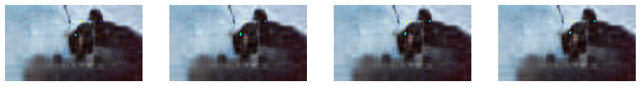

# Using SVD To Compress Images

In this Python Notebook, I wrote a short python program for compressing images by cutting out singular values from the Singular Value Decomposition matrix, and converting that back into an image. Below is the function that compresses a single channel of an image given a specified output rank.


```python
from PIL import Image, ImageOps
import numpy as np
import matplotlib.pyplot as plt
     
# Open a grayscale bmp file
img = Image.open(r'C:\Users\jonat\Documents\Code\FruitGrayscale.bmp')

# This function takes an image and decomposes the bitmap using SVD, then each composite matrix
#    is sliced by the given output matrix rank and multiplied together to create a compressed image
def compress_image(img, rank):
    # Apply SVD
    U, S, Vt = np.linalg.svd(img)
    # SLice matrices and create compressed image
    c_img = np.dot(U[:,:rank], np.dot(np.diag(S[:rank]), Vt[:rank, :]))
    return c_img
```


---


Now we use the function to compress two black and white images. One 900x600 pixel image of a pomegranate, and one 225x225 image of a cat.

---


```python
## Initialize Matplotlib plots for displaying the images
fig2, ax2 = plt.subplots(1,2,figsize=(15,5))
fig, ax = plt.subplots(1,4,figsize=(16,7))

# Init a list of output image ranks to iterate through
rank = [1,5,10,250]

# Loop through the list of ranks and create and graph an SVD compressed image
for i, rk in enumerate(rank):
    c_img = compress_image(img, rk)
    ax[i].imshow(c_img, cmap='gray')
    ax[i].set_axis_off()
    title = 'rank = ' + str(rk)
    ax[i].set_title(title)
    

# Plot the Singular Values of the original image
U, S, Vt = np.linalg.svd(img, full_matrices=True)
ax2[0].plot(S)
ax2[0].set_title('Singular Values')
ax2[1].imshow(img)
ax2[1].set_axis_off()
ax2[1].set_title('Original Grayscale Image')
```


    Text(0.5, 1.0, 'Original Grayscale Image')


    

    


    

    


Now the other image


```python
def invert_image(c_img):
    for i, row in enumerate(c_img):
        for j, pixel in enumerate(row):
            c_img[i][j] = 255 - c_img[i][j]   
    return c_img

img = Image.open(r'C:\Users\jonat\Documents\Code\cat.bmp')
fig2, ax2 = plt.subplots(1,2,figsize=(15,5))
fig, ax = plt.subplots(1,4,figsize=(16,7))

#   For some reason this image needed to be inverted again
rank = [1,5,10,200]
for i, rk in enumerate(rank):
    c_img = invert_image(compress_image(img, rk))
    ax[i].imshow(c_img, cmap='gray')
    ax[i].set_axis_off()
    title = 'rank = ' + str(rk)
    ax[i].set_title(title)
    

# Plot the Singular Values of the original image
U, S, Vt = np.linalg.svd(img, full_matrices=True)
ax2[0].plot(S), ax2[0].set_title('Singular Values'), ax2[1].imshow(img)
ax2[1].set_axis_off(), ax2[1].set_title('Original Grayscale Image')
```


    (None, Text(0.5, 1.0, 'Original Grayscale Image'))


    

    


    

    


## Compressing Colored Images
To compress colored images the only difference is that each channel needs to get the SVD treatement seperately and then stitched back together. 


```python
img = np.asarray(Image.open(r'C:\Users\jonat\Documents\Code\colorveggies.bmp'))
red, green, blue = img[:,:,0], img[:,:,1], img[:,:,2]


fig, ax = plt.subplots(1, 4, figsize=(12, 8))
ax[0].imshow(img), ax[0].set_title('Original Image'),
ax[1].imshow(red, cmap='Reds'), ax[1].set_title('Red'),
ax[2].imshow(green, cmap='Greens'), ax[2].set_title('Green'),
ax[3].imshow(blue, cmap='Blues'), ax[3].set_title('Blue')

for i in range(4):
    ax[i].set_axis_off()
img1 = np.zeros_like(img)
rank = [30,5,1]
for i, rk in enumerate(rank):
    red1, green1, blue1 = (compress_image(red, rk)), (compress_image(green, rk)), (compress_image(blue, rk))
    fig1, ax1 = plt.subplots(1, 4, figsize=(12, 8))
    for i in range(4):
        ax1[i].set_axis_off()
    img1[:,:,0], img1[:,:,1], img1[:,:,2] = red1, green1, blue1
    title = 'Rank = ' + str(rk)
    ax1[0].imshow(img1), ax1[0].set_title(title), ax1[1].imshow(red1, cmap='Reds'), ax1[1].set_title(title),
    ax1[2].imshow(green1, cmap='Greens'), ax1[2].set_title(title), ax1[3].imshow(blue1, cmap='Blues'), ax1[3].set_title(title)
    
```


    

    


    

    


    

    


    

    


# Video Compression

Now we move on and try to compress videos. This next function (mostly from StackExchange) takes a video file and breaks it up into jpeg files.


```python
import cv2
import numpy as np
import os
import sys
import argparse

def extractImages(pathIn, pathOut):
    count = 0
    vidcap = cv2.VideoCapture(pathIn)
    success,image = vidcap.read()
    success = True
    while success:
        success,image = vidcap.read()
        cv2.imwrite( pathOut + "\\frame%d.jpg" % count, image)     # save frame as JPEG file
        count = count + 1
    print(count, ' Pictures Created From The Video')
    
# Uncomment to run
#extractImages('C:\\Users\\jonat\\Documents\\Code\\VideoCompression\\cat.mp4', 'C:\\Users\\jonat\\Documents\\Code\\VideoCompression\\Cat_Images\\')

```

## Threaded Compression

Now that we have a folder of JPEGs, we can iterate through them, compress them using the SVD method, and save them to another folder. 

Doing successive operations on images takes a lot of time and I do not have a GPU to speed it up, I have done the minimal level of multithreading to make it faster. 


```python
from concurrent import futures
from itertools import repeat

# Insert path to images and output path
image_folder = 'C:\\Users\\jonat\\Documents\\Code\\VideoCompression\\Cat_Images\\'
new_image_folder = 'C:\\Users\\jonat\\Documents\\Code\\VideoCompression\\Cat_Images_Compressed_Rank20\\'


# This function compresses a JPEG with a given rank
def threaded_compress_image(file, rk):
    
    img = np.asarray(Image.open(r'C:\Users\jonat\Documents\Code\VideoCompression\Cat_Images\\' + file))
    img1 = np.zeros_like(img)
    rgb_matrix = [img[:,:,0], img[:,:,1], img[:,:,2]]
    
    executer = futures.ThreadPoolExecutor(max_workers=3)
    results = executer.map(compress_image, rgb_matrix, repeat(rk))
    result_comp = [np.asarray(result) for i, result in enumerate(results)]
    
    img1[:,:,0], img1[:,:,1], img1[:,:,2] = result_comp[0], result_comp[1], result_comp[2]
    
    cv2.imwrite(new_image_folder + file, (img1))
    return None


images = [img for img in os.listdir(image_folder) if img.endswith(".jpg")]

def sortfunc(name):
    return int(name[5:-4])
images.sort(key=sortfunc)


rank = 20  # This is where you change the rank
executer = futures.ThreadPoolExecutor(max_workers=5
results = executer.map(threaded_compress_image, images, repeat(rank))
photos = [result for i, result in enumerate(results)]  # Iterate through all the images in the folder and comopress them.

print('Images Compressed')
```

    Images Compressed
    

Here are some images from the compressed version of the MP4 File


```python
for row in range(4):
    fig, ax = plt.subplots(1, 4, figsize=(16, 8))
    for column in range(4):
        image = 'frame' + str(column + row * 4) + '.jpg'
        image = np.asarray(Image.open(r'C:\Users\jonat\Documents\Code\VideoCompression\Cat_Images_Compressed_Rank10\\' + image))
        ax[column].imshow(image), ax[column].set_axis_off()
```


    

    


    

    


    

    


    

    


## Stitching The Movie Back Together

This is just a function partially ripped from stack exchange for stiching images back into a MP4 file, I run this block with different input and output paths to create each compressed video.


```python
video_file = 'C:\\Users\\jonat\\Documents\\Code\\VideoCompression\\Cat_Stitched_RankFull.mp4'
image_folder = 'C:\\Users\\jonat\\Documents\\Code\\VideoCompression\\Cat_Images_Compressed_Rank20\\'
image_size = (1920, 1080)
fps = 29

def sortfunc(name):
    #print(name[5:-4])
    return int(name[5:-4])
images = [img for img in os.listdir(image_folder) if img.endswith(".jpg")]
images.sort(key=sortfunc)

out = cv2.VideoWriter(video_file, cv2.VideoWriter_fourcc(*'MP4V'), fps, image_size)

img_array = []
for filename in images:
    img = cv2.imread(os.path.join(image_folder, filename))
    img_array.append(img)
    out.write(img)

out.release()
print('Video Stitched')
```

    Video Stitched

# Analysis of Video Compression
Now we look at the output of the program after being run multiple times with different ranks. We see that the filesize does decrease notably as the rank gets lower, but counterintuitively the filesize actually increases using mid-ranged ranks which warrants further investigation.


